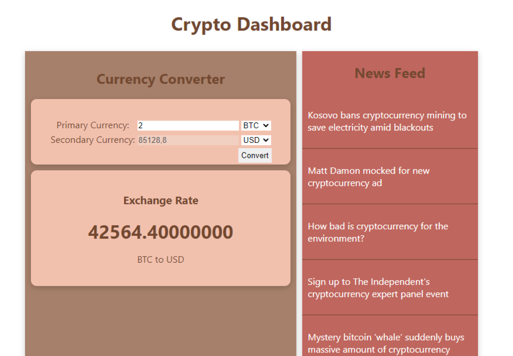

# Crypto Dashboard

<!--- (Confira o resultado em: [endereço](https://huannvictor.github.io/crypto-dashboard/)  -->


# Sobre o projeto: Crypto Dashboard

Dashboard feita seguindo o tutorial do canal [Code with Ania Kubów](https://www.youtube.com/watch?v=WDwhJNbWka0&t=2997s) onde consumi informações de duas APIs do marketplace [RapidApi.com](http://rapidapi.com).
- Alpha Vantage: para converter as moedas com valores atualizados.  
  [link aqui](https://rapidapi.com/alphavantage/api/alpha-vantage/)  
- Crypto News: onde encontramos notícias do universo crypto.  
  [link aqui](https://rapidapi.com/enochmwanga@gmail.com/api/crypto-news15) 

Nessa aplicação simples podemos converter valores e ver as principais notícias do universo de crypto moedas.

## Tecnologias
[](https://pt-br.reactjs.org/)  
[](https://nodejs.org/en/)  


## Bibliotecas & Utilitários
  [](https://axios-http.com/)  
  [](https://expressjs.com/)

# Como executar

## `npm i`
- instale todas as dependências necessárias  


## arquivo `.env`
- crie um arquivo `.env` no `root` do seu projeto e nele insira o seguinte código:
```bash
REACT_APP_RAPID_API_KEY={sua_chave_api_aqui}
```
_sem essas informação seu código não conseguirá acessar as informações das APIs_  
_você encontra sua chave assim que subscrever nas APIs, dentro marketplace_  
_tutorial (em inglês) de como conseguir sua rapidApiKey: [aqui](https://youtu.be/WDwhJNbWka0)_

## execute: `npm run start:frontend`
- comando roda o aplicativo no mode de desenvolvimento, acesse: http://localhost:3000 no navegador.

## execute: `npm run start:backend`
 - comando inicia o servidor em http://localhost:8000


## Layout Final


